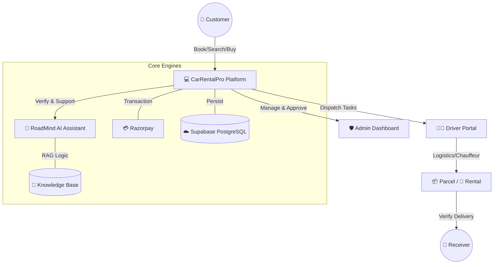

# 🚗 CarRentalPro | Premium Mobility & Logistics Platform


**CarRentalPro** is an advanced, multi-service platform that redefines urban mobility by integrating **Luxury Car Rentals**, a **Dynamic Auto Marketplace**, and **AI-Driven Logistics** into a single, cohesive ecosystem. Built with a modern Glassmorphism aesthetic, it delivers a high-end experience for users, drivers, and administrators.

---

## 🏗️ System Architecture & Workflow



---

## 🌟 Core Modules & Detailed Functionality

### 1. 🏎️ Car Rental Ecosystem
*   **Flexible Rental Modes**: Seamlessly switch between **Self-Drive** and **Chauffeur-Driven** luxury vehicles.
*   **Luxury Fleet Management**: Features high-performance sedans, premium SUVs, and luxury EVs.
*   **Dynamic Fare Computation**: Real-time price calculation based on duration, vehicle tier, and location.
*   **Smart Scheduling**: Integrated calendar for real-time fleet availability and conflict avoidance.

### 2. 📦 RoadMind Logistics (Smart Parcel Delivery)
*   **Ride-Share Logistics**: Parcels are dynamically assigned to drivers already traveling on matching routes, significantly reducing costs and emissions.
- **Advanced Security Protocols**: 
    - **Pickup**: 12-digit hashed QR code verification.
    - **Delivery**: SMS/Email triggered OTP (One-Time Password) for secure handovers.
*   **Live Multi-Stakeholder Tracking**: Real-time GPS location updates for sender, receiver, and driver.

### 3. 💰 Dynamic Marketplace (Buy, Sell & Bid)
*   **Curated Car Showcase**: High-resolution gallery with technical specifications and history.
*   **Bidding System**: Integrated offer-management system allowing real-time price negotiation between buyers and sellers.
*   **Listing Verification**: Strict admin approval workflow to ensure only verified, high-quality listings enter the marketplace.

### 4. 🤖 RoadMind AI Assistant (Gemini-Powered)
*   **Advanced RAG Implementation**: Specifically fine-tuned using Retrieval-Augmented Generation to provide context-aware support based on internal documentations.
*   **Automated Troubleshooting**: Instant resolution for common booking issues, platform navigation, and technical queries.
*   **24/7 Concierge**: High-speed, natural language interaction powered by Google’s Gemini 1.5 Flash.

---

## 👥 Role-Based Experience

| Role | Key Capabilities |
| :--- | :--- |
| **User (Customer)** | Search rentals, list cars for sale, bid on listings, book parcel deliveries, track orders live. |
| **Driver** | Manage active trip assignments, verify parcel pickup/delivery, update live status, manage profile. |
| **Admin** | Live monitoring of all trips, approval of cars and drivers, management of bookings and payments. |

---

## 🛠️ Advanced Technology Stack

- **Backend Architecture**: Scalable **Flask (Python)** API with **SQLAlchemy** ORM and **Bcrypt** encryption.
- **Database Layer**: High-availability **Supabase (PostgreSQL)** with complex relational schemas.
- **AI Engine**: **Google Gemini SDK** integrated with a custom-built vector-like knowledge base (RAG).
- **Payment Infrastructure**: **Razorpay** API for secure, PCI-compliant transactions and refunds.
- **Frontend Layer**: Modern **Glassmorphism** UI built with responsive HTML5/CSS3 and Vanilla JS.
- **DevOps/Tools**: Environment-based configuration (`python-dotenv`), real-time logging, and SMTP mail servers.

---

## 📂 Project Hierarchy

```bash
CarRentalPro/
├── admin/            # Fleet monitoring & approval dashboards
├── ai_assistant/     # RoadMind AI core logic & training RAG data
├── backend/          # Flask application logic, DB models, & API routes
├── book_car/         # Rental booking system & fleet selection
├── customer/         # Customer personal dashboards & transaction history
├── driver/           # Task management & verification systems for drivers
├── parcel/           # Logistics portal & tracking interface
├── sell_buy/         # Auto marketplace, bidding engine, & car listings
├── checkout/         # Secure payment gateway & receipt generation
├── service/          # Support modules, insurance info, & contact hubs
└── design_system.css # Centralized premium UI framework
```

---

## 🚀 Professional Setup Guide

### 1. Environment & API Configuration
1. Navigate to the `backend/` directory.
2. Initialize your Python environment and install core requirements:
    ```bash
    pip install flask flask-cors flask-bcrypt sqlalchemy psycopg2 razorpay google-generativeai python-dotenv
    ```
3. Configure the `.env` file with high-security credentials:
    ```env
    DATABASE_URL=postgresql://[user]:[password]@[host]:[port]/[db]
    GEMINI_API_KEY=your_gen_ai_key_here
    RAZORPAY_KEY_ID=your_razorpay_key
    RAZORPAY_KEY_SECRET=your_razorpay_secret
    EMAIL_USER=your_smtp_email
    EMAIL_PASS=your_app_password
    ```

### 2. Initializing & Running
1. Deploy the API:
    ```bash
    python backend/app.py
    ```
2. Launch the frontend: Open `index.html` in a modern, Web-GL enabled browser.
3. **Verification**: Ensure the backend confirms "Connected to Supabase" on startup.

---

## 🎨 Design Philosophy
The platform employs **The Glassmorphism Paradigm**. We focus on depth through translucency, vibrant background gradients, and high-fidelity typography to create a sense of trust and premium quality for the user.

---

*Designed and Architected for the Future of Urban Mobility.*